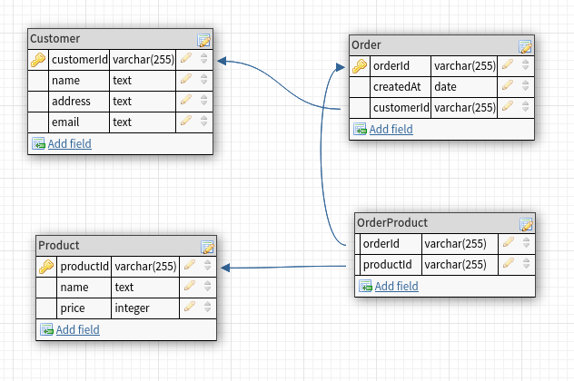
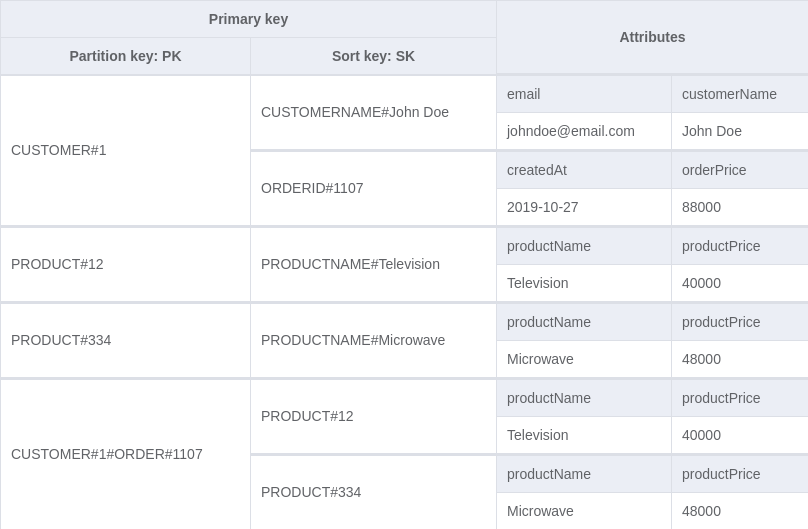
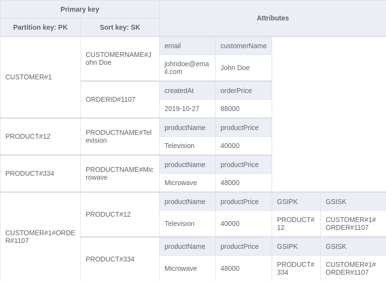
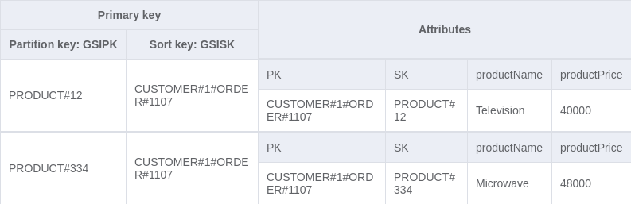

*Cover Photo by [Dietmar Becker](https://unsplash.com/@dietmarbecker?utm_source=unsplash&utm_medium=referral&utm_content=creditCopyText) on [Unsplash](https://unsplash.com/s/photos/comparison?utm_source=unsplash&utm_medium=referral&utm_content=creditCopyText)*

Let's talk DB design.

## What is Relational Database Design?

Relational Database(DB) Design organizes data in a database into relations, which are one or more tables of columns and rows, with a unique key identifying each row. Rows are also called records or tuples. Columns are also called attributes. Generally, each table/relation represents one "entity type" (such as customer or product). The rows represent instances of that type of entity (such as "John" or "chair") and the columns represent values attributed to that instance (such as address or price).

## What is DynamoDB?

Amazon DynamoDB is a fully managed, serverless, key-value NoSQL database designed to run high-performance applications at any scale. It promises consistent single-digit millisecond performance at any scale. DynamoDB charges for reading, writing, and storing data in your DynamoDB tables so it is **Pay-as-you-go** which means you only pay for exactly what you use.

This performance along with its pricing model is among the factors which make DynamoDB so attractive. The tricky part with DynamoDB is what comes next.

Unlike the relational DB model where each entity gets a separate table and joins are performed to group related data across tables and fetch them together e.g fetching all the products bought by a customer, DynamoDB does not support joins. To tackle this issue, a common design pattern is the single-table model.

## What is the Single-Table Design?

In single-table design, all the entities in the DynamoDB database use the same table and by making use of certain structures unique to DynamoDB, individual entities can still be fetched and several common relational access patterns can be performed.

Enough talk! Let's see some modelling

## Entities

Let's take three entities to model. These entities could be part of an e-commerce application. They are: customer, product and order. The relationship between them can be defined as such:

- A one-to-many relationship exists between the customer and order entities.
- A many-to-many relationship exists between the order and product entities.

## Modelling a Relational Design

To represent this in relational design, we'd have something like this:

Here we have the classic schema with a different table for each entity and a join `OrderProduct` table for modelling the many-to-many relationship between the Order and Product entities. With this, we can get all the information we need about the various entities and perform joins to retrieve information about the relationship between entities like the names of products in an order, the orders a customer has made and so on.

## Modelling DynamoDB's Single-Table Design

Unlike relational design where we start by representing the entities in tables and figure out the queries we need to retrieve the data from the table when modelling in DynamoDB, we need to first know the queries we need *before* creating the table. This is crucial in allowing us to perform queries efficiently because of DynamoDB's query structure.

- Listing data access requirements: Of course, you don't have to write out every possible access pattern your application might need, you just want to identify the core access patterns. Since these entities are being used in the context of an e-commerce application, a few queries we might need are:
  1. Get all orders that belong to a customer.
  2. Get information about all the products in an order.
  3. Get all the orders made for a particular product.
  4. Sort a customer's orders by price.

In a real-world application, there would be much more access patterns depending on what the business requirements are but these three will do for now.

### DynamoDB's query structure

DynamoDB tables consist of items that are themselves a collection of key-value pairs. The keys of the items are referred to as attributes, examples of attributes on an item could be; name, price, date etc. For the most part, like most NoSQL databases DynamoDB doesn't enforce strict conditions when creating tables save for [a few rules](https://docs.aws.amazon.com/amazondynamodb/latest/developerguide/HowItWorks.NamingRulesDataTypes.html).

One of the important conditions though is the [primary key](https://docs.aws.amazon.com/amazondynamodb/latest/developerguide/HowItWorks.CoreComponents.html#HowItWorks.CoreComponents.PrimaryKey). Let me explain, the primary key of an item uniquely identifies it among other items in a table and you specify what the primary key of items in a table is when you create it. The primary key can either be:

- a simple primary key which consists of an attribute specified as a partition key, or
- a composite key which consists of two attributes, a partition key and a sort key.

When querying the data in a table, you can use a [`key condition expression`](https://docs.aws.amazon.com/amazondynamodb/latest/developerguide/Query.html#Query.KeyConditionExpressions) to specify criteria to match the primary key on and an optional [`filter expression`](https://docs.aws.amazon.com/amazondynamodb/latest/developerguide/Query.html#Query.FilterExpression) to further refine the results based on other attributes items might have. In DynamoDB, the pricing on a query depends on the number of items that match the key condition expression, regardless of how many items you decide to then filter out with a filter expression as such it becomes important to structure our data such that we can perform most if not all our access patterns with key condition expressions.

### Designing the DynamoDB table

The key entities can be represented in a single table using the pattern below. Where PK means partition key and SK means sort key:

| ENTITY | PK | SK |
| --- | --- | --- |
| CUSTOMER | CUSTOMER#`[customer id]` | CUSTOMERINFO#`[customer name]` |
| ORDER | CUSTOMER#`[customer id]` | ORDER#`[order id]` |
| PRODUCT | PRODUCT#`[product id]` | PRODUCTNAME#`[product name]` |

This table design allows us to get orders that belong to a customer by querying the partition key and sort key with the appropriate prefixes and the customer's id e.g with the key condition expression: `PK = CUSTOMER#[customer id] and begins_with(SK, "ORDER#")`, we can also get a customer's details by a combination of the customer's id and the `CUSTOMER_INFO#` prefix.

Having the entities represented here is nice but this design doesn't provide us with an efficient way of querying the orders made for a product or getting the details of products in an order per our required access patterns above.

To fix that we'll add an order-product representation to our table for the relationship between an order and a product. For the PK and SK we'll use the structures `CUSTOMER#[customer id]#ORDER#[order id]` and `PRODUCT#[product id]` respectively. This allows us to get the list of products in an order with the key condition expression: `PK = CUSTOMER#[customer id]#ORDER#[order id] and begins_with(SK, "PRODUCT#")`. An example of what our table looks like with some dummy data is shown below:

To fetch orders that a product is a part of, we need to be able to query the order-product representation by the product id directly. To do this, we add a [Global secondary index (GSI)](https://docs.aws.amazon.com/amazondynamodb/latest/developerguide/HowItWorks.CoreComponents.html#HowItWorks.CoreComponents.SecondaryIndexes) to the table. This allows us to create a partition key and a sort key different from those defined on the table. We can add new GSIPK and GSISK attributes to the order-product representation which will be the partition key and sort key for the new index respectively.

For the order-product representation, we'll store:

- `PRODUCT#[product id]` in GSIPK, and
- `CUSTOMER#[customer id]#ORDER#[order id]` in GSISK

Resulting in a new table that looks like this:

Now we can perform a query with the key condition expression: `GSIPK = PRODUCT#[product id]` on the new GSI. This fetches all the order-product entries with that `product id`. Visualizing the new GSI, we have:

Finally, to sort a customer's orders by price, we need to add a sort key on the price value of an order. This is because, by default, query results are always sorted by the sort key value and optionally ordered in either ascending or descending order. Currently, the order representation has a partition key `CUSTOMER#[customer id]` and a sort key `ORDER#[order id]`. To add a new sort key here, we need to create another index, this time a **[Local Secondary Index (LSI)](https://docs.aws.amazon.com/amazondynamodb/latest/developerguide/HowItWorks.CoreComponents.html#HowItWorks.CoreComponents.SecondaryIndexes)** on the `orderPrice` attribute.

While a GSI creates a new primary key (partition and sort key), an LSI only creates a new sort key on the preexisting partition key. This allows us to sort the item collections under a partition key based on several attributes, in this case, based on the `orderPrice` attribute. The query to fetch a customer's orders sorted by price would now be a key condition expression: `PK = CUSTOMER#[customer id]` on the new LSI.

## Review

At the end of our modelling, our table has:

- a main composite key: `PK` and `SK`.
- a local secondary index (LSI): Partition key is `PK` and sort key is `orderPrice`.
- a global secondary index (GSI): Partition key is `GSIPK` and the sort key is `GSISK`.

Our access patterns have been handled:

1. Get all orders that belong to a customer.  
   key condition expression: `PK = CUSTOMER#[customer id] and begins_with(SK, "ORDER#")`
2. Get information about all the products in an order.  
   key condition expression: `PK = CUSTOMER#[customer id]#ORDER#[order id] and begins_with(SK, "PRODUCT#")`
3. Get all the orders made for a particular product.  
   key condition expression: `GSIPK = PRODUCT#[product id]` on the new GSI
4. Sort a customer's orders by price.  
   key condition expression: `PK = CUSTOMER#[customer id]` on the new LSI.

## Conclusion

In conclusion, while relational database design keeps data normalized, DynamoDB isn't a slouch either. It does not allow for joins, but by modelling your data properly or using certain patterns like the single-table pattern join-like queries can be performed. There are certainly more hoops to jump through when designing an effective data solution for DynamoDB but the advantages once done can be considerable.

As such, if you're considering using DynamoDB over a relational database solution, like a lot of things in software engineering, it would depend on your particular use case, business requirements, access patterns, budget etc. So let me know in the comments, in which use cases would you favour DynamoDB over a relational database solution?

Cheers!
