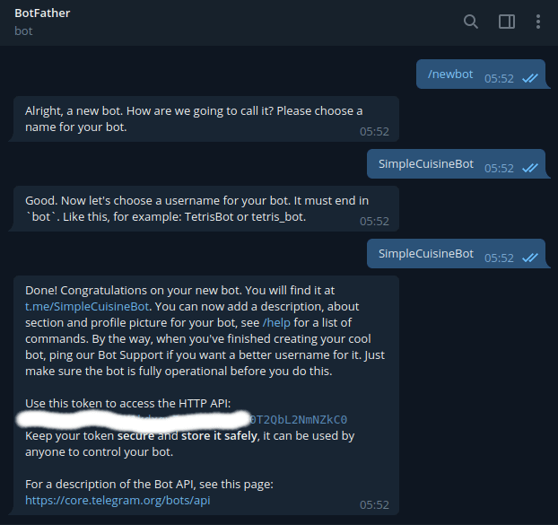
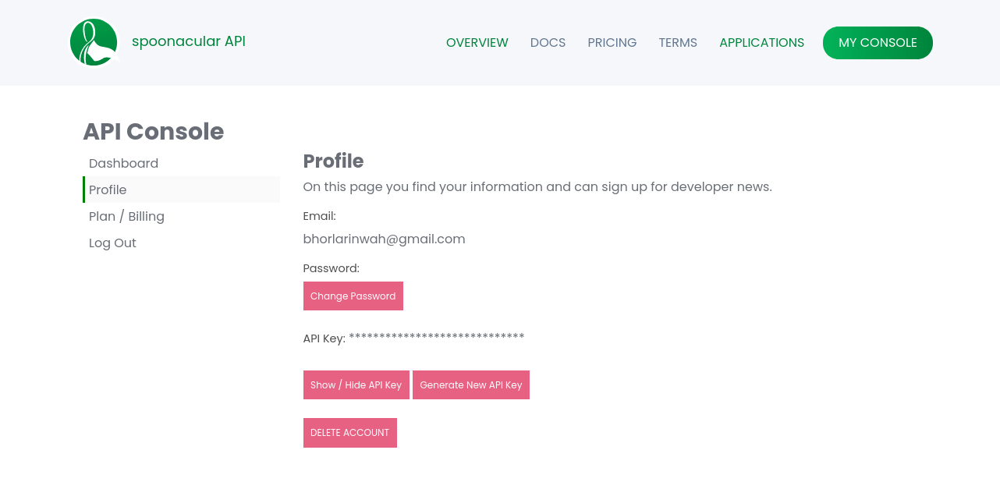
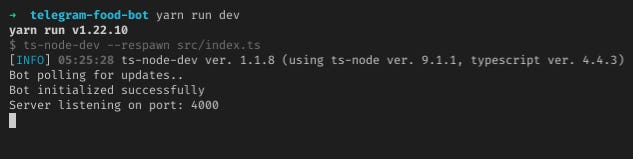
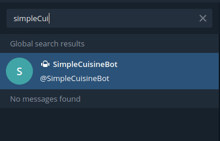
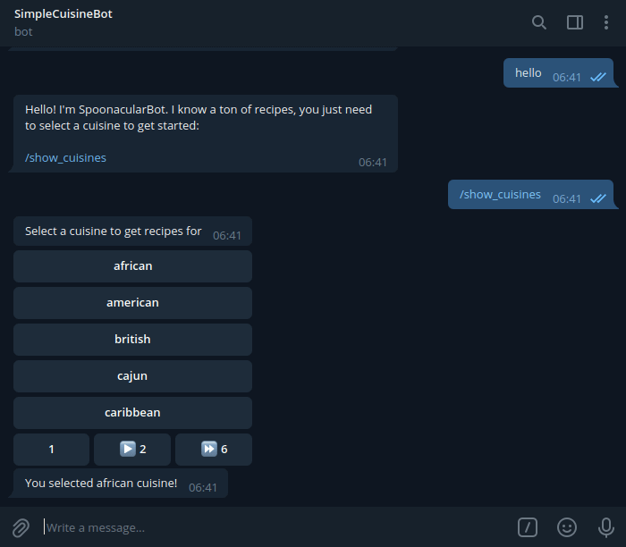
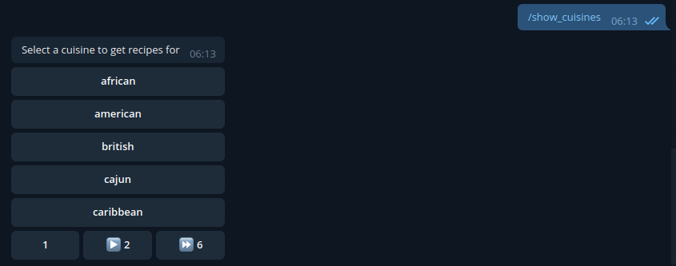
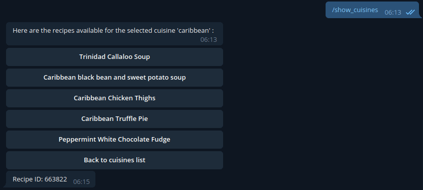
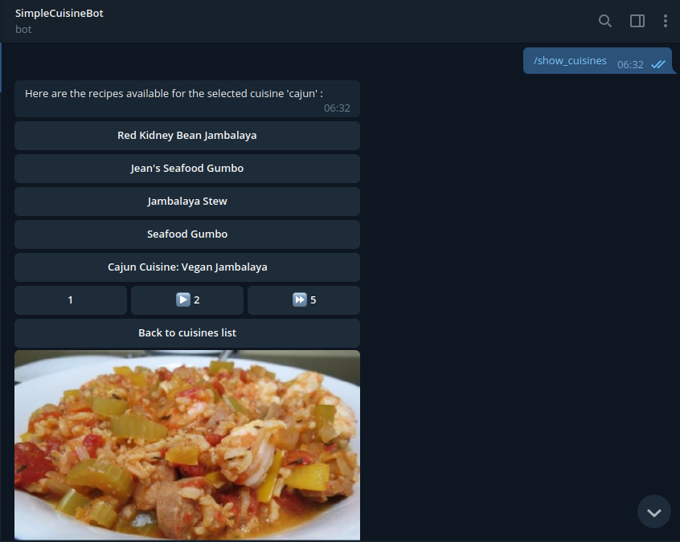
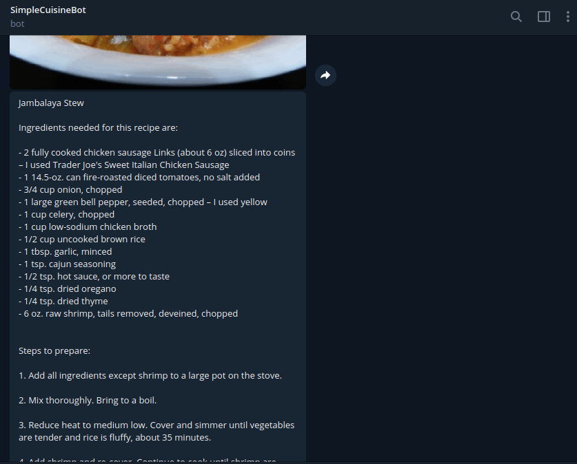
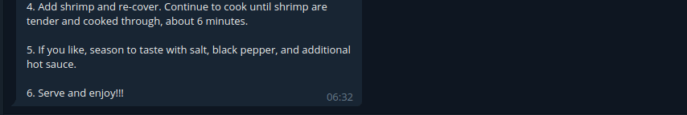

*Photo by [Davide Cantelli](https://unsplash.com/@cant89?utm_source=unsplash&utm_medium=referral&utm_content=creditCopyText) on [Unsplash](https://unsplash.com/s/photos/food?utm_source=unsplash&utm_medium=referral&utm_content=creditCopyText)*

I find it fascinating how Telegram opens itself up to users and developers alike, its extensibility as a platform makes it possible to do [so many things](https://telegramchannels.me/bots) with it. Recently, I've been working on a bot of my own. It's a bit large and I've enjoyed working on it so I thought I'd write about building one. To that end, we're going to be building a Telegram food bot. Our food bot is going to do a few things:

- Show a list of available cuisines.
- Fetch recipes for a cuisine.
- Get preparation instructions for a recipe.

To accomplish these things we're going to be using the [spoonacular API](https://spoonacular.com/food-api). The code for this tutorial is [on github](https://github.com/RinwaOwuogba/telegram-food-bot/) and the bot is deployed on Heroku if you want to check it out [on telegram](https://t.me/SimpleCuisineBot).

### Prerequisites

To follow along with this tutorial, you need to have:

- Node v14.7.1 or above installed
- A good understanding of TypeScript
- Basic knowledge of Axios

### Setup

#### Getting a bot token from [botfather](https://core.telegram.org/bots#6-botfather)

Following the instructions on telegram's [bot page](https://core.telegram.org/bots), you'll need to create an access token for the bot:



Keep that safe you'll be needing it.

#### Getting an API key from Spoonacular

You need to first create an account on [Spoonacular](https://spoonacular.com/food-api/console#). Once logged in, you can get your API key under the profile section of your dashboard.



#### Bootstrapping a TypeScript project

Next, we have to set up a TypeScript project. Going into all the steps involved here would make this much longer so I created a project starter that we can just use instead. To get started you can clone [this repo](https://github.com/RinwaOwuogba/ts-template-project.git) or if you're on a Linux terminal just run:

```bash
git clone https://github.com/RinwaOwuogba/ts-template-project.git
mv ts-template-project/ telegram-food-bot/
cd telegram-food-bot/
rm -rf ./.git
rm README.md
```

These commands clone the project locally and delete git files from the cloned repository.

We can then rename the folder. In this case, we're renaming it to `telegram-food-bot`. And I know that's a bit on the nose but hey, [KISS](https://en.wikipedia.org/wiki/KISS_principle).

#### Adding bot dependencies

We need to add the dependencies we need for this specific project.

```bash
yarn add telegraf telegraf-inline-menu axios express dotenv
yarn add -D @types/node @types/express
```

#### Add .env file

To load environmental variables in development, we're using the `dotenv` module. `dotenv` allows us to load environmental variables from a `.env` file. Create a `.env` file in the root directory of your project then add some of the variables we'll need:

```bash
BOT_TOKEN=[YOUR_BOT_TOKEN_FROM_BOT_FATHER]
SPOONACULAR_API_KEY=[YOUR_API_KEY_FROM_SPOONACULAR]
# if you decide to deploy
APP_URL=[URL_FOR_YOUR_BOT]
```

#### Create a configuration file

Create a `src/config.ts` file. I prefer to use a config file to reference environment variables. It keeps it so that any general changes to those variables happen in one place and not all over the codebase. We'll populate it with this:

```typescript
import { config as dotenvConfig } from 'dotenv';

// loads environmental variables from .env file
// when in development
if (process.env.NODE_ENV !== 'production') {
  dotenvConfig();
}

const config = {
  appUrl: process.env.APP_URL,
  telegramBot: {
    token: process.env.BOT_TOKEN || 'xxxx',
    webhookUrl: `${process.env.APP_URL}${process.env.BOT_TOKEN}` || 'xxxx',
  },
  isProduction: process.env.NODE_ENV === 'production',
  port: process.env.PORT || 4000,
  spoonacular: {
    apiKey: process.env.SPOONACULAR_API_KEY || 'xxxx',
  },
};

export default config;
```

The structure of the config file is based on personal preference, the only thing here that might seem weird is the `webhookUrl` key which is a URL for Telegram to call when sending updates to the bot e.g new messages. Its structure is based on [telegram's suggestions](https://core.telegram.org/bots/api#setwebhook) for security reasons.

#### Add basic types

Create a `src/types.ts` file. Here we'll define the custom type definitions we need for the bot.

```typescript
import { Context } from  'telegraf';


/**
* All bot commands.
*/
export enum FoodBotCommands {
    showCuisines = 'show_cuisines',
}

/**
* Additional data passed in context
*/
interface  ISessionData {
    page?: number;
    itemCount?: number;
}

/**
* Custom context to contain additional context fields
*/
export  interface  IFoodContext  extends  Context {
    session: ISessionData;
    match: RegExpExecArray | undefined;
}
```

`FoodBotCommands` defines the list of telegram commands that the bot will make available to users, we only have one command but a larger bot would have a much larger list.

Telegraf creates a `Context` instance for every incoming update which like the name implies represents the context the update is coming from - details about the telegram user, message that triggered the update etc. `IFoodContext` defines additional fields that the bot is going to need but aren't available in the default `Context` type, more on it later.

The reason for the different casing styles in the `FoodBotCommands` enum is because of [telegram's naming convention for bot commands](https://core.telegram.org/bots/api#botcommand) which doesn't allow uppercase characters thus restricting us to [snake case](https://en.wikipedia.org/wiki/Snake_case).

#### Setup command handlers

Messages sent to the bot trigger updates from telegram. We need to define handlers for those updates. Create a `src/telegram/handlers.ts` and populate with:

```typescript
import { Telegraf } from 'telegraf';
import { FoodBotCommands, IFoodContext } from '../types';

// set up bot update handlers
const botCommandHandlers = (bot: Telegraf<IFoodContext>): void => {
  // Sends a default response to text that doesn't match
  // any registered commands
  bot.on('text', async (ctx) =>
    ctx.reply(
      `Hello! I'm SimpleCuisineBot. I know a ton ` +
        `of recipes, you just need to select a ` +
        `cuisine to get started: \n\n` +
        `/${FoodBotCommands.showCuisines}`
    )
  );

  // default error handler
  bot.catch(async (error: unknown, ctx) => {
    console.log('Bot error', error);

    await ctx.reply('Sorry, something went wrong while handling your message.');
  });
};

export default botCommandHandlers;
```

There are different handlers for different types of updates, the `bot.on("text")` is the default handler for any text message. Handlers are matched in the order they are defined so we'll add more specific handlers above it and leave messages that don't match any other handlers to it. In this case, we're sending a default message in the default handler.

`bot.catch` is the default handler for any errors that occur in the application. We'll add more error handling logic later.

#### Create session middleware

If you recall in `src/types` we defined `IFoodContext`, in which we added additional properties to the default `Context` created by Telegraf. Among them was a `session` property, to make sure that this property is available in all instances of `Context` in the event handlers we need to create a custom middleware to create in on every update. Create a `src/telegram/middlewares/createSession.ts` file. Add the following code:

```typescript
import { MiddlewareFn } from  'telegraf';
import { IFoodContext } from  '../../types';

/**
* Adds session property to the user context
* whenever a request is received
* */
const  createSession: MiddlewareFn<IFoodContext> = async (ctx, next) => {
    Object.assign(ctx, { ...ctx, session: {} });

    return  next();
};

export  default  createSession;
```

#### Initialize the bot

Create a `src/telegram/index.ts` file. Here's where the telegram bot will be initialized. We're going to add middlewares, setup handlers for commands sent to the bot, send telegram a list of all the commands that the bot handles and set up the mechanism for receiving updates from telegram:

```typescript
import { Telegraf } from 'telegraf';
import { BotCommand } from 'telegraf/typings/core/types/typegram';
import config from '../config';
import { IFoodContext, FoodBotCommands } from '../types';
import botCommandHandlers from './handlers';
import createSession from './middlewares/createSession';

// list of commands the bot will handle
export const botCommands: readonly BotCommand[] = [
  {
    command: FoodBotCommands.showCuisines,
    description: 'show available cuisines',
  },
];

export const bot = new Telegraf<IFoodContext>(config.telegramBot.token);

export const startTelegramBot = async (): Promise<void> => {
  // register middlewares
  const middlewares = [createSession];
  middlewares.forEach((middleware) => bot.use(middleware));

  // setup command handlers
  botCommandHandlers(bot);

  // register available bot commands on telegram server
  await bot.telegram.setMyCommands(botCommands);

  if (!config.isProduction) {
    // use polling mode in development
    bot.launch();
    console.log("Bot polling for updates..")
  } else {
    // use telegram webhookurl in prod
    bot.telegram.setWebhook(config.telegramBot.webhookUrl);
  }
};
```

The structure of each `botCommand` in the `botCommands` list is dictated by the `BotCommand` type. `botCommands` list is the argument to `bot.telegram.setMyCommands` which sends telegram the list of commands.

In order to receive updates from telegram such as new messages, we can either use `polling` mode or provide a `webhookUrl` for telegram to call whenever there's an update. We're going to use `polling` mode while building the bot locally and set a `webhookUrl` when in production (in case you want to deploy the bot).

#### Add webhook handler

Create a `src/api/index.ts` file:

```typescript
import express from 'express';
import config from '../config';
import { bot } from '../telegram';

const app = express();

// webhook to handle updates from telegram in prod
app.use(bot.webhookCallback(`/${config.telegramBot.token}`));

export default app;
```

The path to the webhook handler is the same as `config.telegramBot.webhookUrl` since we're just adding a `/config.telegramBot.token` route to the base app URL.

`bot.webhookCallback` passes messages received from Telegram by calls to this route to the bot.

#### Start the project

In `src/index.ts` we'll add code to start the bot.

```typescript
import  app  from  './api';
import  config  from  './config';
import { startTelegramBot } from  './telegram';

const  startProject = async () => {
    // initialize telegram bot
    try {
        await startTelegramBot();
        console.log('Bot initialized successfully');
    } catch (error) {
        console.log('Something went wrong while initializing bot');
        console.log(error);
        process.exit(1);
    }

    // start API server
  app
    .listen(config.port, () => {
      console.info(`Server listening on port: ${config.port}`);
    })
    .on('error', (error) => {
      console.error(error);
      process.exit(1);
    });
};

startProject();
```

If we encounter any errors while initializing the bot or starting the server, we terminate the process.

Since we're using polling mode for development, the API server will only be started in a production environment.

At this point the structure of your project should look like this:

```
├── .env
├── package.json
├── src
│   ├── api
│   │   └── index,ts
│   ├── config.ts
│   ├── index.ts
│   ├── telegram
│   │   ├── handlers.ts
│   │   ├── index.ts
│   │   └── middlewares
│   │       └── createSession.ts
│   └── types.ts
├── tsconfig.json
└── yarn.lock
```

### Building the features

#### Show a list of available cuisines

From the Spoonacular API docs, I've gathered a list of the available cuisines so we'll be using that. Create a `src/cuisineList.ts` file for the cuisines:

```typescript
const cuisineList: string[] = [
  'african',
  'american',
  'british',
  'cajun',
  'caribbean',
  'chinese',
  'eastern european',
  'european',
  'french',
  'german',
  'greek',
  'indian',
  'irish',
  'italian',
  'japanese',
  'jewish',
  'korean',
  'latin american',
  'mediterranean',
  'mexican',
  'middle eastern',
  'nordic',
  'southern',
  'spanish',
  'thai',
  'vietnamese',
];

export default cuisineList;
```

We'll use a telegram inline menu to display the list of available cuisines and to create the menus we are going to make use of `telegraf-inline-menu` to which we installed earlier.

First, we need to update our types in `src/types.ts`. We need an additional `cuisines` field in `ISessionData`, which will contain a list of recipes

```typescript
interface ISessionData {
  cuisines?: string[];
  page?: number;
  itemCount?: number;
}
```

Also, we need to create a `src/constants.ts` file for a few constants that we'll be needing such as the API URL and the number of rows to display on each menu page. I set it to five here but you can make it any number you want:

```typescript
export  const  SPOONACULAR_API_URL = 'https://api.spoonacular.com';

// maximum number of rows in any menu page
export  const  MAXIMUM_MENU_ROWS = 5;
```

Next, for the cuisine list menu itself, create a `src/telegram/menus/cuisineListMenu.ts` file:

```typescript
import { Body, MenuTemplate } from 'telegraf-inline-menu/dist/source';
import { ConstOrContextPathFunc } from 'telegraf-inline-menu/dist/source/generic-types';
import { IFoodContext } from '../../types';
import cuisineList from '../../cuisineList';
import { MAXIMUM_MENU_ROWS } from '../../constants';

const cuisineListMenuLogic: ConstOrContextPathFunc<IFoodContext, Body> = (ctx) => {
  const { page } = ctx.session;

  // no of cuisines to skip in current menu page
  let offset = 0;

  // skip cuisines in previous pages
  if (page) {
    offset = (page - 1) * MAXIMUM_MENU_ROWS;
  }

  // list of cuisines to display for current menu
  // page
  ctx.session.cuisines = cuisineList.slice(
    offset,
    offset + MAXIMUM_MENU_ROWS + 1
  );

  // store total cuisine count to allow pagination method
  // calculate no of pages in current menu
  ctx.session.itemCount = cuisineList.length;

  const text = 'Select a cuisine to get recipes for';

  return text;
};

const cuisineListMenu = new MenuTemplate<IFoodContext>(cuisineListMenuLogic);

// add cuisines in list to menu
cuisineListMenu.choose('selectedCuisine', (ctx) => ctx.session.cuisines || [], {
  do: async (ctx, key) => {
    await ctx.reply(`You selected ${key} cuisine!`);
    await ctx.answerCbQuery();

    return false;
  },
  buttonText: (ctx, key) => key,
  disableChoiceExistsCheck: true,
  maxRows: MAXIMUM_MENU_ROWS,
  columns: 1,
});

// add buttons to paginate cuisine list over several
// menu pages
cuisineListMenu.pagination('cuisineListPagination', {
  setPage: (ctx, page) => {
    ctx.session.page = page;
  },
  getCurrentPage: (ctx) => ctx.session.page,
  getTotalPages: (ctx) => (ctx.session.itemCount as number) / MAXIMUM_MENU_ROWS,
});

export default cuisineListMenu;
```

Alright, let's talk about what the code above is doing:

We start by defining `cuisineListMenuLogic` which is a function to initialize the `cuisineListMenu`. This function is run whenever the menu is loaded or reloaded.

To keep the menu interface neat we're going to split the static list of cuisines over several pages and `cuisineListMenuLogic` is where we put the logic to determine the cuisines to be displayed on the current page of the menu.

In `cuisineListMenuLogic` we try to determine the current page we're on and using the current page number in addition to the number of rows to display per menu page we select the cuisines to be displayed on the current page. We then store the current list of cuisines to display and the total number of cuisines altogether in `ctx.session` to make it available to other functions in the menu.

```typescript
const cuisineListMenu = new MenuTemplate<IFoodContext>(cuisineListMenuLogic);
```

Afterwards we instantiate `cuisineListMenu`.

The `.choose` method on a menu creates a group of buttons on the menu and attaches an action to be performed whenever any of the choices is selected. It takes an action prefix, a list of choices and options to configure the behaviour of this group of buttons respectively.

- action prefix: Every sub-menu, menu or group of buttons attached to a menu in `telegraf-inline-menu` requires an identifier, it can be anything but identifiers for all paths under a specific menu have to be unique. Here `selectedCuisine` is the action prefix.
- choices: Choices the user can pick from. The choices here are the list of cuisines on the current page.
- options:
  - `do`: is the action to be performed when an option is selected. Currently, we send a message containing the selected cuisine's name whenever a cuisine is selected by using `ctx.reply`. `ctx.reply` is a shorthand method for sending messages back to the chat in the current context. `ctx.answerCbQuery` is a shorthand method to let telegram know that the action for that choice has been completed so it stops displaying a progress bar for it. The return value of this function determines the behaviour of the menu after the action is completed, returning false makes the menu do nothing.
  - `buttonText`: is used to determine the text to be displayed on the buttons added to the menu. We use the key which is the name of each cuisine for its respective button text.
  - `disableChoiceExistsCheck`: `telegraf-inline-menu` tries to prevent choices not present from being selected. Since we build the choices dynamically by selecting a range of cuisines when the menu is initially loaded or reloaded then by the time a user selects a cuisine, the check for the choice would always fail since the cuisine list would be empty so we need to disable it.
  - maxRows: Number of rows to use in displaying cuisines on each menu page.
  - columns: Number of columns to use in displaying cuisines.

Next, we set up the pagination buttons for the menu by calling the `.pagination` method. `.pagination` takes an action prefix and pagination options. Let's go over the pagination options:

- setPage: Function to run whenever a page is selected
- getCurrentPage: Returns the current page the menu is on.
- getTotalPages: Used in creating the navigation buttons for a menu. We calculate the number of pages here by using the total number of cuisines and the number of rows to be used in displaying cuisines on each page.

To use this menu in the bot we need to create a menu middleware. Create a `src/telegram/middlewares/menuMiddleware.ts` file:

```typescript
import { MenuMiddleware } from 'telegraf-inline-menu/dist/source';
import { IFoodContext } from '../../types';
import cuisineListMenu from '../menus/cuisineListMenu';

/**
 * Middleware needed to track and respond to inline
 * menu button clicks
 */
const menuMiddleware = new MenuMiddleware<IFoodContext>('/', cuisineListMenu);

export default menuMiddleware;
```

`MenuMiddleware` takes a root menu to render by default and a root path for that menu.

Register this middleware in `src/telegram/index.ts`:

```typescript
import  menuMiddleware  from  './middlewares/menuMiddleware';

// register middlewares
const  middlewares = [createSession, menuMiddleware];
```

Finally, add a command handler to render `cuisineListMenu`. Let's add a new handler in `src/telegram/handlers.ts`.

```typescript
import  menuMiddleware  from  './middlewares/menuMiddleware';

// show list of all cuisines
bot.command(FoodBotCommands.showCuisines, async (ctx) =>
  menuMiddleware.replyToContext(ctx)
);
```

`.replyToContext` sends a menu in response to a message. Since we didn't specify a path argument, menu middleware sends the default `cuisineListMenu`.

Start the bot locally by running:

```bash
yarn run dev
```

You'll see an output like this on the console:



Finding the bot on telegram



Messaging the bot we get:



#### Fetch recipes for a specific cuisine

Users should get a list of recipes when they select a cuisine. The list of recipes for a particular cuisine will also be displayed on a menu.

First, we need to update our types in `src/types.ts`. We need an additional `recipes` field in `ISessionData`, which will contain a list of recipes

```typescript
interface ISessionData {
  recipes?: IRecipe[];
  cuisines?: string[];
  page?: number;
  itemCount?: number;
}
```

Add a few additional types:

```typescript
/**
 * Recipe item returned by spoonacular
 */
export interface IRecipe {
  id: number;
  title: string;
  image: string;
  imageType: string;
}

/**
 * Spoonacular recipes search response
 */
export interface IRecipesResponse {
  results: IRecipe[];
  offset: number;
  number: number;
  totalResults: number;
}
```

`IRecipe` represents a recipe item returned by the spoonacular API.

`IRecipesResponse` represents the result of requesting a list of recipes under a particular cuisine.

Create a new `src/telegram/menus/recipeListMenu.ts` file. We'll define the `recipeListMenu` to display the recipes under a cuisine.

```typescript
import axios from 'axios';
import { createBackMainMenuButtons, MenuTemplate } from 'telegraf-inline-menu';
import { ConstOrContextPathFunc } from 'telegraf-inline-menu/dist/source/generic-types';
import { SPOONACULAR_API_URL, MAXIMUM_MENU_ROWS } from '../../constants';
import config from '../../config';
import { IFoodContext, IRecipesResponse } from '../../types';

/**
 *  Fetch recipes from spoonacular
 */
const fetchRecipes = async (cuisine: string, page: number) => {
  const { data } = await axios.get<IRecipesResponse>(
    `${SPOONACULAR_API_URL}/recipes/complexSearch`,
    {
      params: {
        apiKey: config.spoonacular.apiKey,
        cuisine,
        number: MAXIMUM_MENU_ROWS, // number of recipes to return at a time
        // skip recipes in previous pages
        offset: page * MAXIMUM_MENU_ROWS,
      },
    }
  );

  return data;
};

/**
 * Logic for controlling recipe list menu
 */
const recipeListMenuLogic: ConstOrContextPathFunc<IFoodContext, string> =
  async (ctx) => {
    const { page } = ctx.session;
    const cuisine = ctx.match ? ctx.match[ctx.match.length - 1] : '';

    // check that selected cuisine is not empty
    if (!cuisine) {
      throw new Error('Cuisine not provided');
    }

    // fetch recipes list from spoonacular
    const data = await fetchRecipes(cuisine, page ? page - 1 : 0);

    let text = '';

    if (data.results.length === 0) {
      text = 'There are no recipes available for the selected cuisine:';
    } else {
      text = `Here are the recipes available for the selected cuisine '${cuisine}' :`;
      ctx.session.recipes = data.results;
      ctx.session.itemCount = data.totalResults;
    }

    return text;
  };

/**
 * Menu to list all recipes
 * */
const recipesListMenu = new MenuTemplate<IFoodContext>(recipeListMenuLogic);

// Add each available recipe to menu
recipesListMenu.choose(
  'showRecipe',
  (ctx) => {
    const { recipes } = ctx.session;

    // constructs choices list out of recipe ids
    return recipes ? recipes.map((recipe) => recipe.id) : [];
  },
  {
    do: async (ctx, key) => {
      await ctx.reply(`Recipe ID: ${key}`);
      await ctx.answerCbQuery();

      return false;
    },
    buttonText: (ctx, key) => {
      const { recipes } = ctx.session;

      const currentRecipe = recipes?.find(
        (recipe) => recipe.id === Number(key)
      );

      return currentRecipe ? currentRecipe.title : '';
    },
    columns: 1,
    disableChoiceExistsCheck: true,
    maxRows: MAXIMUM_MENU_ROWS,
  }
);

// Paginates recipes results
recipesListMenu.pagination('recipeListItem', {
  setPage: (ctx, page) => {
    ctx.session.page = page;
  },
  getCurrentPage: (ctx) => ctx.session.page,
  getTotalPages: (ctx) => (ctx.session.itemCount as number) / MAXIMUM_MENU_ROWS,
});

// enable navigating to previous and main menu
recipesListMenu.manualRow(
  createBackMainMenuButtons('previous', 'Back to cuisines list')
);

export default recipesListMenu;
```

That's a lot, let's go through what each section is doing:

To start with, `fetchRecipes` is a utility function that fetches a list of recipes for a particular cuisine from the spoonacular API. It uses Axios to make an HTTP request and we define the response data type as the `IRecipesResponse` type we just added to `src/types.ts`.

The `/recipes/complexSearch` endpoint takes a number of parameters which you can check on the [offical docs](recipes/complexSearch) but we're only using four of them for the purpose of this tutorial:

- apiKey: This is your API key from Spoonacular and is required for every API call.
- cuisine: Cuisine name to get recipes for
- number: Number of recipes to return at a time. We're making use of the `MAXIMUM_MENU_ROWS` constant we created earlier since the number of recipes we show at a time is limited.
- offset: Number of recipes to skip. We use this in addition to the `number` param to paginate the returned recipes list.

`recipeListMenuLogic` is the function that `recipeListMenu` runs when loaded. Remember that menus have identifier's? The full path to a menu is included in `ctx.match` and the selected cuisine is included in the path so we can get it from there. `recipeListMenuLogic` then fetches recipes for the selected cuisine from spoonacular and sets a message depending on the API response.

The arguments for `recipeListMenu.choose` are similar to `cuisineListMenu` with a few differences:

- For the list of choices, we return the recipe IDs instead of the recipe names because the full path to each choice is included in the [callback data](https://core.telegram.org/bots/api#callbackquery) for each button representing a choice on the menu and Telegram limits the size of callback data to 1 - 64 bytes. Since some recipes might have really long names, using their IDs is more reliable.
- `do`: sends the recipe ID when a choice is selected
- `buttonText`: tries to get the matching recipe name for each recipe ID passed to it as a key.

We then add pagination to this menu and then manually create a new row of buttons on the menu using `recipesListMenu.manualRow`.

`createBackMainMenuButtons` create buttons to navigate to the previous menu if the previous menu is not the root menu and to the root menu directly. The arguments to it are the names to be shown on each button which are the previous menu button text and the root menu button text respectively. Since `recipeListMenu` is only one path down from the `cuisineListMenu`, only the root menu navigation button will be displayed.

Next, we have to connect `cuisineListMenu` and `recipeListMenu` such that when a cuisine button is selected, the recipes for that cuisine are displayed.

Update `src/telegram/menus/cuisineListMenu.ts`. Replace `cuisineListMenu.choose` with a new `cuisineListMenu.chooseIntoSubmenu`:

```typescript
import recipesListMenu from './recipeListMenu';

// Show cuisine recipes when cuisine is selected
cuisineListMenu.chooseIntoSubmenu(
  'recipeList',
  (ctx) => ctx.session.cuisines || [],
  recipesListMenu,
  {
    buttonText: (ctx, key) => key,
    disableChoiceExistsCheck: true,
    maxRows: MAXIMUM_MENU_ROWS,
    columns: 1,
  }
);
```

Now, let's test the bot so far:





#### Get preparation instructions for a specific recipe

To display preparation instructions on selecting a specific recipe, we start by adding even more types to `src/types.ts`:

```typescript
/**
 * Individual recipe instruction step
 */
interface IRecipeStep {
  number: number;
  step: string;
  ingredients: {
    name: string;
  }[];
}

/** Recipe instructions from spoonacular */
interface IRecipeInstructions {
  name: string;
  steps: IRecipeStep[];
}

/**
 * Full recipe information from Spoonacular
 */
export interface IRecipeInformation {
  title: string;
  image: string;
  extendedIngredients: {
    original: string;
  }[];
  analyzedInstructions: IRecipeInstructions[];
}
```

`IRecipeInformation` represents a part of the full details of a recipe that we're concerned with as returned by spoonacular. We've broken this information into several types simply to make it easier to reason about

`IRecipeInstructions` represents the preparation instructions for a recipe and `IRecipeStep` is each of the individual steps to be followed in order.

Next, we have to update `src/telegram/menus/recipeListMenu.ts`:

- Update the imports:

```typescript
import { IFoodContext, IRecipeInformation, IRecipesResponse } from  '../../types';
```

- Create a new function to send the recipe instructions rather than a simple message containing the recipe ID:

```typescript
/**
* Show recipe information on telegram
*/
const showRecipeInformation = async (ctx: IFoodContext, recipeId: string) => {
  const { data } = await axios.get<IRecipeInformation>(
    `${SPOONACULAR_API_URL}/recipes/${recipeId}/information`,
    {
      params: {
        apiKey: config.spoonacular.apiKey,
      },
    }
  );

  // format list of ingredients
  const ingredients = `Ingredients needed for this recipe are:\n\n${data.extendedIngredients
    .map((ingredient) => `- ${ingredient.original}`)
    .join('\n')}`;

  // format recipe instruction steps
  const instructions =
    `Steps to prepare:\n\n` +
    `${
      data.analyzedInstructions.length
        ? data.analyzedInstructions[0].steps
            .map((step) => `${step.number}. ${step.step}`)
            .join('\n\n')
        : 'No steps to display 😅'
    }`;

  // full message
  const message = `${data.title}\n\n${ingredients}\n\n\n${instructions}`;

  await ctx.replyWithPhoto(data.image);
  await ctx.reply(message);
  await ctx.answerCbQuery();

  return false;
};
```

In `showRecipeInformation`, we fetch the information for a recipe then concatenate the recipe name with its list of ingredients and instruction steps into a single message.

Then we send a picture of the finished recipe along with the concatenated message to the user.

- Pass the new function to `do` in `recipeListMenu.choose`:

```typescript
do:  async (ctx, key) =>  showRecipeInformation(ctx, key),
```

Let's start the bot locally to test again:







And everything works fine!

We're almost done, we just need to update our error handling logic. Update `bot.catch` in `src/telegram/handlers.ts`:

- Update the imports

```typescript
import { AxiosError } from  'axios';
import { CallbackQuery } from  'telegraf/typings/core/types/typegram';
```

- Update the function in `bot.catch`:

```typescript
// default error handler
bot.catch(async (error: unknown, ctx) => {
 console.log('Bot error', error);

 // remove progress bar from menu button on error
 if ((ctx.callbackQuery as CallbackQuery.DataCallbackQuery)?.data)
   await ctx.answerCbQuery();

 // handle axios errors
 if ((error as AxiosError).isAxiosError) {
   const status = (error as AxiosError).response?.status;

   // handle daily quota limit error from Spoonacular
   // https://spoonacular.com/food-api/docs#Quotas
   if (status === 402) {
     await ctx.reply(
       '😅 Sorry, we seem to have reached our daily quota limit for the ' +
         'spoonacular API and cannot handle any more requests today'
     );

     return;
   }
 }

 await ctx.reply('Sorry, something went wrong while handling your message.');
});
```

We're dealing with two things here:

- Remember that telegram uses callback data to handle menu logic? So we call `ctx.answerCbQuery` if an error occurs while handling a message that has callback data to notify Telegram to stop showing a progress bar for that menu item.
- Spoonacular has daily quota limits for requests to its API. Once this limit is exceeded, all API calls are rejected with an HTTP status code`402`. So we need to handle that error when it occurs in an Axios request.

And that's all!
