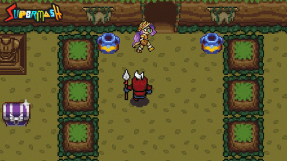
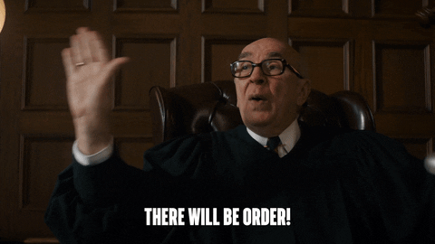
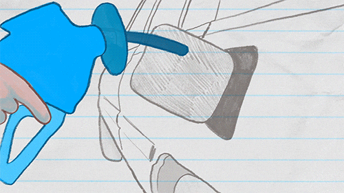
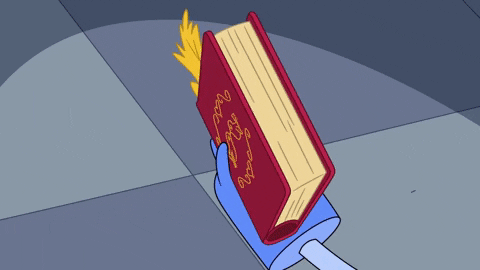

## Introduction

Have you ever played on a giant playground full of exciting games, where you can make your own rules and create your own adventures? Well, what if I told you there's a massive playground just like this, but it's hidden inside our computers and smartphones? This incredible playground is called Ethereum.

Ethereum is kind of like your favourite online game. You know, the one where you can play with friends, trade special items, and even build your own virtual world? Just like a bunch of friends playing an online game together, Ethereum is actually made up of many, many computers from all over the world, all playing together at the same time.

And the most exciting part? Each of these computers has its very own game console! In the world of Ethereum, we call this special game console the 'Ethereum Virtual Machine', or 'EVM' for short. Each EVM can run lots of different games, help players trade items, and even keep score!

So, are you ready to dive in and learn all about this incredible playground and its game consoles? Let's get started on our adventure in Ethereum, the biggest playground in the world inside our computers!

## 1: The Game Consoles (EVM) in Every Computer

You know how when you're playing with your game console at home, you can play all sorts of different games, right? Maybe you like to race cars in one game or hunt for treasure in another. And sometimes, you just want to play a simple game like checkers.

Now, let's think about our giant playground called Ethereum. This playground is super cool because every computer connected to it has its own special game console! We call this unique game console the Ethereum Virtual Machine, or EVM for short.

Like your console at home, these EVMs can run lots of different games too. But the games they play are called 'smart contracts'. Each smart contract is like a different game, with its own unique rules and objectives. One smart contract might be like a treasure hunt game, while another one might be more like trading cards with your friends.

But that's not all! These game consoles (EVMs) also do simple tasks, just like your game console can do more than just run games. Have you ever sent a message to a friend through your console, or maybe traded a game item with them? The EVMs can do something similar. They can move virtual coins from one player's account to another, just like how you might send a friend some game items.

Isn't that amazing? Thousands and thousands of game consoles, all playing different games and also doing simple tasks, all at the same time! And even though the games might be different, and the consoles are in different computers, they all work together to make the Ethereum playground a fun and fair place for everyone.

## 2: The Games We Play (Smart Contracts)

You know when you're playing a video game, how each game has its own rules and challenges? Maybe one game has you rescue a princess, and another has you build the tallest tower. Well, the Ethereum playground has games like that too, but we call them 'smart contracts'.

Each smart contract is a special kind of game with its own set of rules. For example, one smart contract might be a game where you can trade virtual pets with your friends. Another smart contract could be a game that helps you save your virtual coins.

And guess what? All the people using Ethereum are like players in this big playground. They use their game consoles (the EVMs we talked about) to play these smart contract games.

Just think about it - you want to trade a shiny virtual dragon for your friend's cool virtual unicorn. You'd go to the 'Pet Trading' smart contract game on your EVM console, and your friend would do the same on theirs. You follow the game's rules, and voila! You've got a cool new unicorn, and your friend now owns a shiny dragon.

But it's not just about trading pets. There are tons of different smart contract games that do lots of fun and helpful things. Some might let you start a virtual lemonade stand and keep track of how many customers you have. Others might let you send virtual birthday presents to your friends.

Fun stuff!

## 3: Playground Rules (Protocols)

Every fun and safe playground has rules, right? Rules like taking turns on the swings, or not running too fast to keep everyone safe. In our giant Ethereum playground, we have rules too! These rules are called 'protocols', and they're super important to make sure everyone plays fairly and has fun.

You can think of protocols like playground rules that tell everyone how to play the games. So, no matter what game you're playing on your game console (EVM), the protocols make sure the game works the same way for everyone. That way, whether you're trading virtual pets, saving virtual coins, or sending virtual gifts, you know the rules will be the same no matter where you are or who you're playing with.

And guess what? These rules, or protocols, are followed by every game console (EVM) in our Ethereum playground. Whether the console is in your computer, your friend's computer, or a computer on the other side of the world, they all follow the same rules. This is what makes the games fair, and what makes our Ethereum playground a great place for everyone to play in.

Just think about how amazing that is! Thousands and thousands of game consoles (EVMs), all playing different games (smart contracts), but all following the same playground rules (protocols). This makes sure the games are fun, fair, and work the same way for everyone in our Ethereum playground!

## 4: Powering the Consoles (Gas)

Do you remember how your game console at home needs power to work? You might have to plug it into a wall socket, or maybe it runs on batteries. Without power, you wouldn't be able to play any games. In our Ethereum playground, the game consoles (EVMs) need power too! But instead of electricity or batteries, they use something called 'Gas'.

Gas is like the power that keeps all the game consoles (EVMs) running and the games (smart contracts) playing. But Gas isn't just about keeping things running; it also makes sure that everyone plays fair. By needing Gas to play a game or do something on Ethereum, it stops anyone from hogging all the game time.

Imagine if someone tried to play all the games in the playground without stopping, leaving no time for anyone else. It wouldn't be much fun, right? Well, Gas prevents that from happening in our Ethereum playground. Since everyone needs Gas to play the games (run smart contracts), it makes sure that everyone gets a turn, and that the game consoles (EVMs) don't get too tired.

Just like how a big, complex video game might use up more of your console's power, some tasks or 'games' in our Ethereum playground need more gas to run. That means when someone wants to do something big or complex in Ethereum, they need to pay more gas.

For example, if you're playing a simple game like checkers, your game console might not need much power. But what if you're playing a big, exciting adventure game with lots of characters and levels? That might use up a lot more power!

In the same way, if you're doing something simple on the Ethereum playground, like sending your friend a virtual coin, it might not need a lot of Gas. But if you're playing a more complex 'game', like trading a hundred different virtual pets all at once, that might need a lot more Gas! And because it's a bigger task, you would need to pay more Gas to get it done. [You can read more on gas here.](/blog/understanding-gas-in-ethereum/)

So, the next time you're playing a game on your console at home, think about how it needs power to run. And remember, in the Ethereum playground, all the game consoles (EVMs) and the games (smart contracts) they run also need power - that power is Gas! And the more complex the game, the more Gas you'll need to pay to play!

## 5: Remembering the Games (Blockchain)

Imagine you're in a giant game arcade, full of many different game consoles. You and your friends are playing games, and there's a big scoreboard that keeps track of all the scores. But in this special arcade, whenever a game is played on one console, all the other consoles in the arcade play the same game too, to double-check the score. This is a bit like how Ethereum works!

In Ethereum's big playground, whenever a game (transaction or smart contract) is played on one game console (EVM), all the other game consoles (EVMs) in the playground run the same game too. They're all double-checking each other to make sure that every game is played correctly and the scores (transactions) are right.

This might sound like a lot of work, but it's very important because it makes sure everything is fair and nobody is cheating. Just like how referees in a game make sure that all players are following the rules, in Ethereum, all the game consoles (EVMs) are making sure every game is played correctly.

But how do all the consoles agree on the scores? Well, after all the game consoles have run the same game, they talk to each other. They all agree on what the scores are and write them down in their copy of the big game diary (blockchain). This process is called consensus, and it's a bit like when you and your friends agree on what the score is after a game.

So, the Ethereum blockchain is like a giant scoreboard or game diary that keeps track of all the games that have been played in the playground. But it's not just any diary; it's a diary that every console in the playground helps write and agree on! This keeps our playground fair, fun, and open for everyone to enjoy.

## Conclusion: Adventure in the Ethereum Playground

Let's recap what we've learned about our amazing Ethereum playground:

- Ethereum is like a gigantic playground that's not in a park or a garden but inside our computers and smartphones!
- Inside this playground, each computer has its very own game console called the Ethereum Virtual Machine, or EVM for short.
- These EVMs are incredible! They can:
  - Play lots of different games, each with its own rules and challenges. These games are known as 'smart contracts'.
  - Perform simple tasks, like moving virtual coins from one player to another.
- Just like a game console at home needs power to work, the EVMs also need power. In Ethereum, this power is called 'Gas'.
  - Gas not only keeps the EVMs running and the games playing but also makes sure everyone gets a turn to play.
  - The more complex the game (smart contract), the more Gas it needs.
- Lastly, let's not forget about our giant game diary, the blockchain. This diary keeps track of every game played and every score made in our Ethereum playground.
  - All the EVMs help write this diary and agree on what's written. This keeps the playground fair and fun for everyone!

Isn't it exciting to think about? A massive playground inside our computers, filled with game consoles (EVMs) playing different games (smart contracts), all powered by Gas and all following the same playground rules!

But our Ethereum adventure doesn't end here. There's so much more to discover and explore:

- You can find new games (smart contracts).
- You could create your own games (smart contracts).
- You're not just a player in the Ethereum playground; you're also part of creating this world.

So, keep exploring, keep learning, and most importantly, keep having fun in the world inside our computers - Ethereum!
